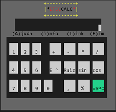

# EtecCalc
Calculadora (Projeto e Publicação)


```
                         Projeto Prático: Software e publicação.
       Projeto desenvolvido para a matéria de Programação de Computadores 1 do curso
                    de "Informática Nova Matriz e Suporte ao Usuário"
                      da Escola Técnica Adolpho Berezin"  de 2020
```
## Manual:

```
Para efetuar uma operação matematica, digite a expressão que deseja e tecle em seguida a tecla "="  ou a barra de espaço
ex.:

operaçoes disponiveis
  + soma                  ex: 2+2
  - subtração             ex: 2-2 ou -2+3
  * Multiplicação         ex: 2*2
  / Divisão               ex: 10/-8  
  S para Seno             ex: S45   (Seno de 45)
  C para Coseno           ex: C34   (Coseno de 34)
  R para Raiz Quadrada    ex: R23   (Raiz quadrada de 23)
  E para Potenciação      ex: 5E3   (5 elevado ao cubo)
  % para porcentagem      ex: 10%78 (10 porcento de 78)

  ** Não esquecer de usar as teclas "=" ou "espaço" para efetuar a operação 

 ```
   Baixe o arquivo no link abaixo e descompacte-o na pasta de sua preferencia.

## _Download_:


[Download do arquivo.zip](dist/EtecCalc.zip)

Para executa-lo:
```
dotnet EtecCalc.dll
```
Para usuarios de windows de um duplo clic no icone 


## Agradecimentos

* [Etec Adolpho Berezin](http://eteab.com.br) 
* [Prof.: Ermogenes Palacio](http://github.com/ermogenes)
* [Prof.: Diego Neri](https://github.com/diegoneri)
* [Dev C#](http://github.com/ermogenes/aulas-programacao-csharp)

---

##  *****************     Fique em casa, use máscara   **************
